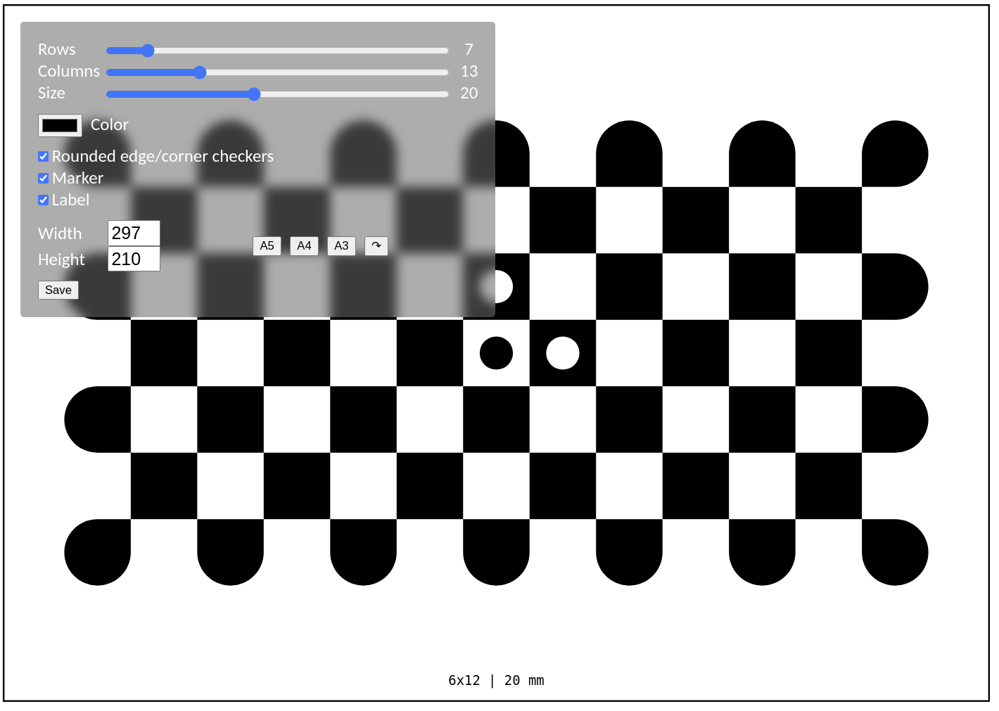

# Checkerboard Generator
A website for generating checkerboard patterns. 

Check it out [here](http://example.com)! 

I created this because I needed to create a pattern for OpenCVs `findChessboardCornersSB` function, which suggests using rounded edge checkers. I later found out that OpenCV already provides a [script](https://github.com/opencv/opencv/blob/master/doc/pattern_tools/gen_pattern.py) for this.

It's nevertheless nice to have an interactive GUI for this. 

Enjoy! 

# Screenshot 

